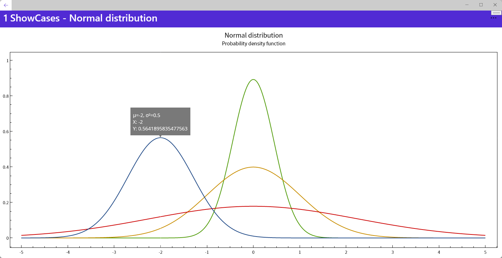

[OxyPlot](https://github.com/oxyplot/oxyplot) is a cross-platform plotting library for .NET

This repository contains the Maui implementation with SkiaSharp base on [OxyPlot.SkiaSharp.Wpf](https://github.com/oxyplot/oxyplot/tree/develop/Source/OxyPlot.SkiaSharp.Wpf) 

[Here](https://github.com/iniceice88/OxyPlot.Xamarin.Forms.Skia) is the xamarin version

#### Features
- Pan(single-finger,two-finger or by drag axis) and Zoom
- Show tracker
- Unicode support

#### Examples

You can find examples in the `/Source/Examples` folder in the code repository.

