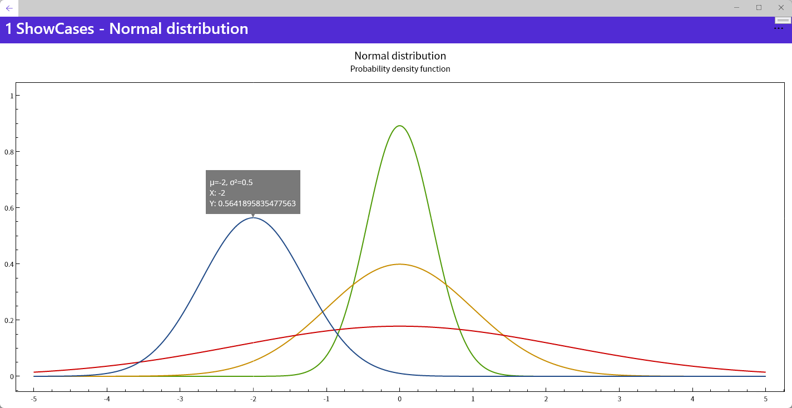

[OxyPlot](https://github.com/oxyplot/oxyplot) is a cross-platform plotting library for .NET.

This repository contains the Maui implementation with SkiaSharp, based on [OxyPlot.SkiaSharp.Wpf](https://github.com/oxyplot/oxyplot/tree/develop/Source/OxyPlot.SkiaSharp.Wpf).

#### Features
- Pan (single-finger, two-finger or by dragging the axis)
- Zoom
- Show tracker
- Unicode support

#### Examples

You can find examples in the [ExampleLibrary](https://github.com/oxyplot/oxyplot/tree/develop/Source/Examples/ExampleLibrary).

